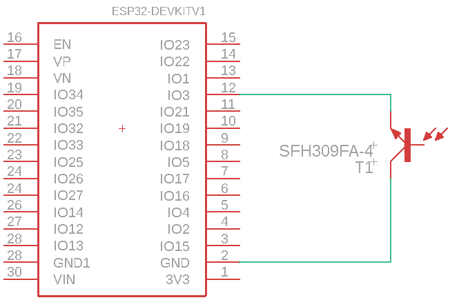
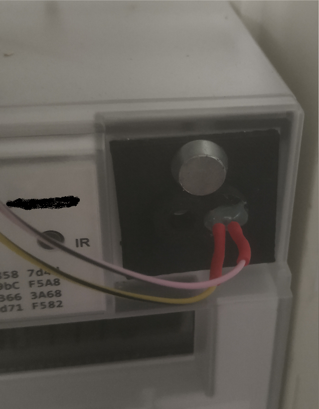
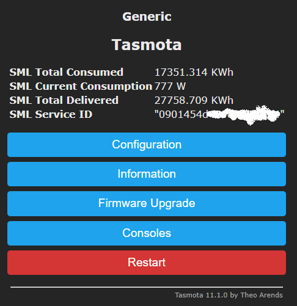
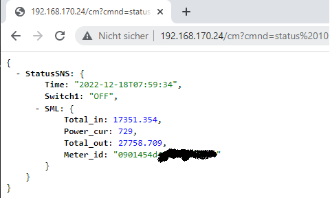

# venusos-native-gridmeter
Connect your existing grid meter to [Victron Venus](https://github.com/victronenergy/venus) and avoid an expensive EM24. Only an addtional [Tasmota](https://github.com/arendst/Tasmota) device and an optical sensor is needed.
There is no need to manipulate Tasmota sources and force higher MQTT rates. Even a MQTT server isn't needed. This solution polls the Tasmota "status 10" interface every 2 seconds.

## Prerequisites
You need
- a Venus device, eg. GX or a raspberry pi
- a IR interface to plug on your smart meter
- a working Tasmota device with a serial port (like a [ESP](https://en.wikipedia.org/wiki/ESP8266) NodeMCU)

## Build & configure Tasmota
Connect the IR interface to the GND and RX/IO3 pin of the ESP device. I choose a simple SFH309-4 IR reciever. Thanks to the pull-up resistor in the ESP there is no need for additional components.



Connect the IR reciever to the GND and RX/IO3 pins directly.



Unfortunately you have to build a Tasmota version supporting scripting by your own. It is described here: https://tasmota.github.io/docs/Smart-Meter-Interface/. There are pre-defined scripts for a lot of smart meters. Search for you smart meter and use the script as described.



Launch your browser with the following url: ```http://{Tasmota IP}/cm?cmnd=status%2010```



You have to edit and upate the values and pathes in the ```config.json``` file according to the shown result.
In the mapping object enter all needed value pathes.
VenusOS needs at least
- ```/Ac/Power```
- ```/Ac/L1/Power```
- ```/Ac/L2/Power```
- ```/Ac/L3/Power```

If your grid meter doesn't provide all information (like L1..L3 power in my example) you can calculate these values, or even copy ```/Ac/Power``` to ```/Ac/L1/Power``` and zero out L2 and L3.

Blank out the ```dataPath``` property to initialise but never update a value.

## Installation
Copy the un-zipped the project to a folder on VenusOS and execute ```install.sh```. Take care that the modifier ```config.json``` is part of this folder.

A target directory ```/data/venus_gridmeter/``` will be created and ```/data/rc.local``` will be created or modified.

Reboot the Venus device.
